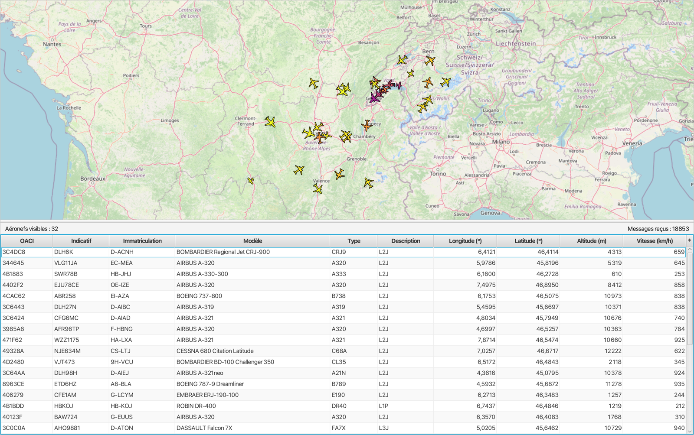

# Javions ✈️

Javions is a live aircraft tracker written in Java and JavaFX. It reads raw radio signals sent by planes, decodes them, and shows the planes on a map.



## About

Planes send short radio messages on 1090 MHz. These messages are called ADS-B. They contain the plane's identity, position, altitude and speed.

Javions takes the raw signal from a radio receiver and turns it into these messages. It then shows every plane on a map and in a table.

This project was made in a team of two, in the course CS-108 (Practice of Object-Oriented Programming) given by Michel Schinz at EPFL, from January 2023 to June 2023.

## Features

- Decodes raw radio samples into ADS-B messages, without any external library
- Reads three types of messages: identification, position and speed
- Checks every message with a CRC-24 and drops the broken ones
- Finds the registration and model of each plane in an aircraft database
- Shows planes on an OpenStreetMap map that you can zoom and move
- Uses a different icon for each type of plane, with a color based on altitude
- Shows the path of a plane when you click on it
- Shows all planes in a table that you can sort
- Removes planes that have not sent a message for one minute
- Works with a recorded file or with a live radio (AirSpy R2)

Note: the app and the code comments are in French, because the course was taught in French.

## Requirements

- macOS or Linux (on Windows, use WSL)
- Java 21 (for example [Eclipse Temurin 21](https://adoptium.net/))
- `curl` and `unzip` (already installed on macOS and most Linux systems)
- An internet connection, to download JavaFX the first time and to load the map

You do not need to install JavaFX. The script downloads it for you.

To check your Java version:

```bash
java -version
```

## How to run

```bash
git clone https://github.com/ethanboren/javions.git
cd javions
./run.sh
```

The first time, the script:

1. finds Java 21 on your computer,
2. downloads JavaFX into the `.javafx/` folder (only once),
3. compiles the code into the `out/` folder,
4. starts the app with a recording of real plane messages.

A window opens. Planes appear after a few seconds. The messages are played at their real speed, so more planes appear over time.

To play the other recording:

```bash
./run.sh resources/messages_20230520_1725.bin
```

### Live mode

Javions can also work with a real radio. For this, you need an AirSpy R2 receiver tuned to 1090 MHz. When the app starts without a file, it reads the raw radio samples from the standard input and decodes them in real time.

## How to use

| Action | Result |
|---|---|
| Scroll on the map | Zoom in or out |
| Drag the map | Move the map |
| Click on a plane | Select it and show its path |
| Click on a column title | Sort the table |
| Double-click on a row | Center the map on this plane |

The name of each plane is shown when you zoom in enough (level 11 or more). Before that, only the selected plane shows its name.

The bar above the table shows the number of planes on screen and the number of messages received.

## How it works

The program is a chain of steps. Each step takes the result of the step before it.

```
AirSpy radio (1090 MHz, 12-bit samples)
        |
        v
SamplesDecoder            bytes -> 12-bit samples
        |
        v
PowerComputer             samples -> signal power
        |
        v
PowerWindow               a moving window over the power values
        |
        v
AdsbDemodulator           finds the start of each message and reads its 112 bits
        |
        v
RawMessage                checks the CRC-24
        |
        v
MessageParser             identification, position or speed message
        |
        v
AircraftStateAccumulator  builds the state of one plane from its messages
        |
        v
AircraftStateManager      keeps track of all planes
        |
        v
JavaFX interface          map, icons, paths and table
```

Some details:

- **Finding messages.** Each message starts with a fixed pattern of 4 pulses. The demodulator looks for this pattern in the signal. Then it reads each bit by comparing the power in the first and second half of the bit.
- **Checking messages.** Each message ends with a 24-bit CRC. If the CRC is wrong, the message is dropped. This removes almost all the noise.
- **Finding the position.** Planes send their position in a compact format (CPR). They switch between two versions of it, called "even" and "odd". The program needs one of each to compute the real latitude and longitude.
- **Updating the screen.** The state of each plane is stored in JavaFX properties. The map and the table are linked to these properties, so they update by themselves when a new message arrives.
- **Loading the map.** Map tiles are downloaded from OpenStreetMap. They are kept in memory and saved in the `tile-cache/` folder, so each tile is downloaded only once.

## Project structure

```
javions/
├── run.sh                  script to build and run the app
├── src/ch/epfl/javions/
│   ├── *.java              basic tools: bits, CRC-24, units, positions, map projection
│   ├── demodulation/       from raw samples to raw messages
│   ├── adsb/               message types, decoding and plane state
│   ├── aircraft/           aircraft database
│   └── gui/                JavaFX interface
├── test/                   JUnit 5 tests
└── resources/
    ├── aircraft.zip        aircraft database
    ├── messages_*.bin      recorded messages
    ├── samples.bin         small raw sample file used by the tests
    └── *.css               styles of the interface
```

Two large raw sample files (about 300 MB each) were used during the project. They are not in this repository, because they are too big for GitHub. The recorded messages in `resources/` are enough to run the app.

## Tests

The `test/` folder has JUnit 5 tests for every part of the program. The easiest way to run them is from an IDE like IntelliJ IDEA. A few demodulation tests need the two large sample files, so they will not pass without them.

## Credits

- Made in a team of two for CS-108 at EPFL (January to June 2023). The course gave us the project instructions, the aircraft database and the recordings.
- Map data © [OpenStreetMap](https://www.openstreetmap.org/copyright) contributors.
- Interface built with [OpenJFX](https://openjfx.io/).
